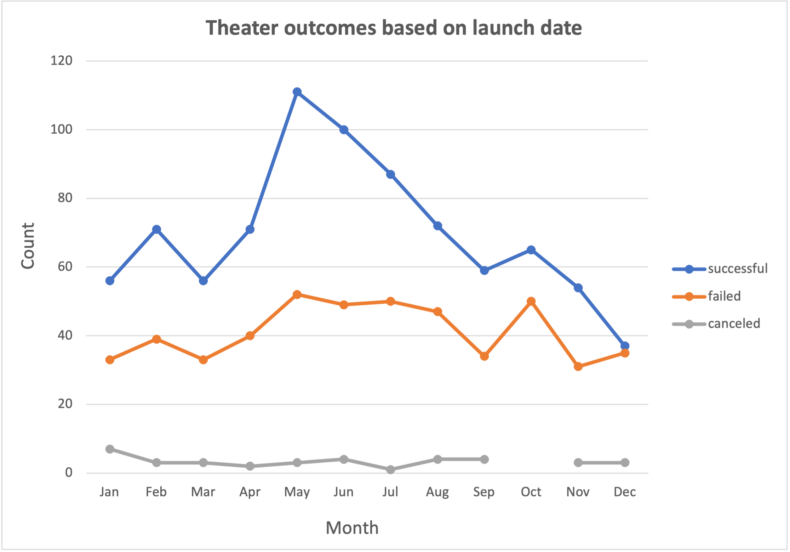
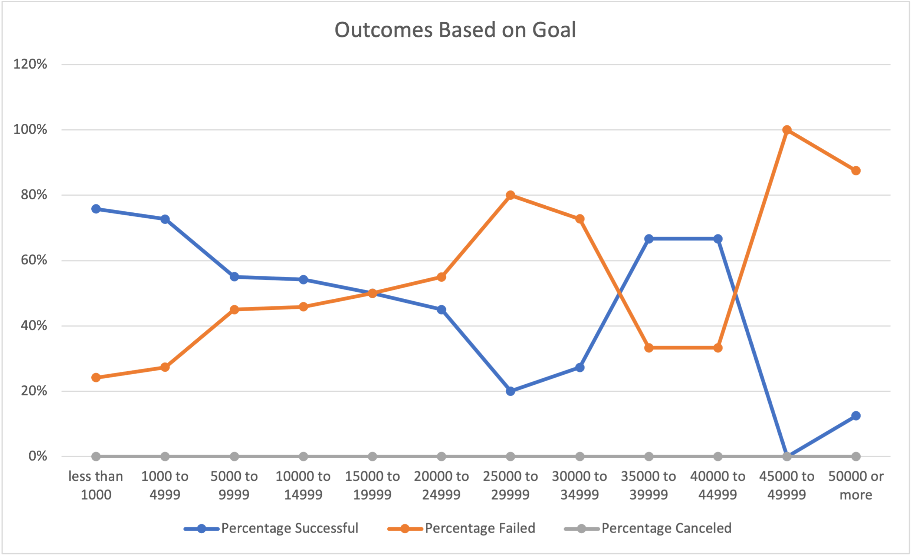

# README: Kickstarting with Excel

## 1. Project Overview

This analysis examines the outcomes of different Kickstarter campaigns for plays depending on their launch dates and on their funding goals. These results will help Louise get a sense of what tends to determine either the success or failure of a funding campaign for a play. 

## 2.1. Analysis

### Launch Dates

I analyzed campaign outcomes as a function of their launch date in Microsoft Excel. Using all available data on Kickstarter campaigns, I created a pivot table filtered on all theater campaigns to count the number of successful, failed, and canceled campaigns launched in each month of the year. I used Excel to create this line chart from the data:  

  

### Funding Goals

I also used Excel to analyze campaign success as a function of funding goals. I binned funding goals into $5,000 bins between $5,000 and $50,000, plus bins for <$1,000, $1,000-$4,999, and >$50,000. I used the 'COUNTIFS' function in Excel on the entire Kickstarter dataset to count the number of successful, failed, and canceled plays within each bin. By summing these outcomes across each bin using the 'SUM' function, I was able to calculate the percentage of plays that were successfully or unsuccessfully funded within each bin. I plotted these outcomes using Excel:

## 2.2. Challenges

While I understood the functions and overall workflow necessary to run these analyses, I did struggle with a slow pace to get the work done. I'm sure this will improve with time, particularly as I learn more tricks and shortcuts to execute functions (like copying/pasting pre-filled values for each funding bin instead of manually typing out the function in each cell).

## 3. Results

### Launch Dates

The data show that the highest number of successfully-funded theater campaigns are launched in the months of May and June. Relatively high numbers of failed campaigns are also launched then, but the overall success rate is still highest in these months. Rates of success and failure are about the same in December - don't launch then!

### Funding Goals

The data show that campaigns for less than $5000 have the highest successful funding rate (73-76%). Generally, the probability of success drops with an increasing goal, though there are relatively high success rates (67%) from $35,000-$44,999. This only represents six total campaigns, though. A deeper look at those particular campaigns might offer insights on how to successfully fund a more expensive play. 

### Limitations

This dataset only includes outcomes for campaigns launched between 2009 and 2017. If trends in campaign funding have changed since then, these data might be outdated and won't be as useful to inform decisions or strategies for launching a new Kickstarter campaign. 

To maximize the chance of funding a new campaign, a more detailed look at successful campaigns might be helpful. For example, by filtering on the subset of campaigns with the highest success rate (those with a goal of <$,5000), we could again explore success by month or create a new subcategory for genre and see which genres of plays tend to be more successful.  